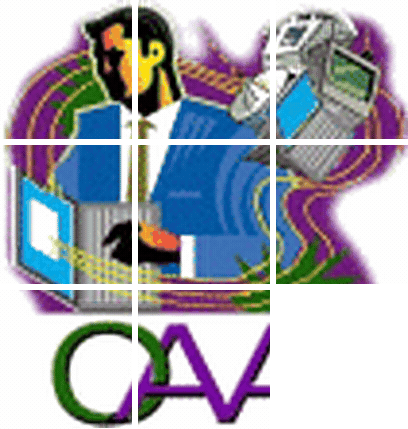
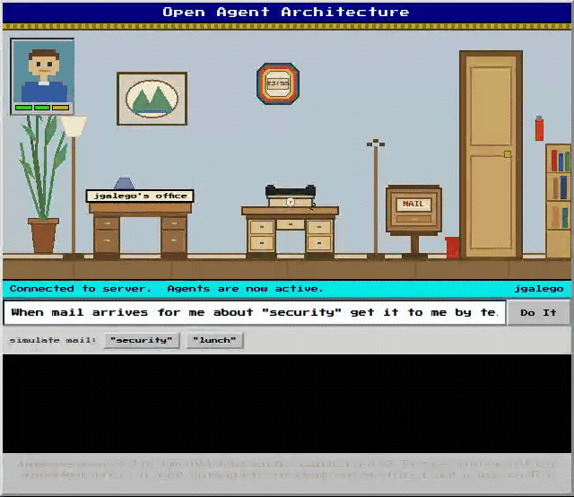

<p align="center">
  <br>
</p>

<p align="center"><strong>Classic agent architecture, modern reasoning.</strong></p>

<p align="center">
  <a href="https://github.com/JGalego/oaa-next/actions/workflows/ci.yml"></a>
  <a href="LICENSE"></a>
  <a href="https://www.swi-prolog.org/"></a>
  <a href="docs/guide/README.md"></a>
  
</p>

An independent reimplementation and modernization of SRI International's [Open
Agent Architecture](https://web.archive.org/web/20071018083337/https://www.ai.sri.com/~oaa) (OAA), extended to support LLM-based agents.

The aim is to rebuild the original architecture and developer experience as
faithfully as the evidence permits, using current implementations of the
original technology stack, and then to add LLM support as an optional
extension that leaves the architecture underneath it alone.

The question the project exists to answer:

> What does the original Open Agent Architecture look like when rebuilt
> faithfully with modern implementations, and given an LLM as a reasoning
> substrate?

## Getting started

### Prerequisites

- 🦉 **SWI-Prolog 9 or newer**, available as `swipl` on your `PATH`
- 🛠️ **GNU Make**
- 🌐 **A modern web browser** for the Office Assistant demo

#### 🐧 Ubuntu / Debian

Install the prerequisites with APT:

```sh
sudo apt update
sudo apt install swi-prolog make
```

#### 🍎 macOS

Install the prerequisites with Homebrew and the Xcode command-line tools:

```sh
brew install swi-prolog
xcode-select --install  # provides make, if it is not already installed
```

#### 🪟 Windows

Install SWI-Prolog from [swi-prolog.org](https://www.swi-prolog.org/Download.html).
Using WSL provides the same `make` workflow shown below.

### 1. Get the project

```sh
git clone https://github.com/JGalego/oaa-next.git
cd oaa-next
```

### 2. Verify the toolchain

```sh
swipl --version
make test
```

`make test` runs the complete suite, including tests that start a live
multi-agent community over TCP.

### 3. Run the Office Assistant demo

```sh
make demo
```

The command starts the Facilitator, mail and telephone agents, the scripted
natural-language agent, and the browser UI. It prints a local URL; open it in
your browser, click **Do It**, then simulate mail about **security**. The
installed trigger routes the matching message to the telephone agent.

<p align="center">
  
</p>

The demo is self-contained: it makes no external LLM request and requires no
API key. Press `Ctrl-C` in the terminal to stop the community.

### 4. Explore further

- [`examples/basic/`](examples/basic/) — minimal agents and delegation
- [`examples/multi-agent/`](examples/multi-agent/) — data, triggers,
  hierarchies, compound goals, and direct connections
- [`examples/llm/`](examples/llm/) — optional LLM-backed agents
- [`docs/guide/README.md`](docs/guide/README.md) — architecture guide,
  tutorial, and API reference

## LLM mode

LLM support is optional and disabled by default. `OAA_CLASSIC` contains no
LLM dependency; setting `OAA_MODE=OAA_LLM` enables the separate extension
under `src/llm/`. The LLM agent remains an ordinary OAA agent: it translates
natural-language requests into ICL goals, while the Facilitator still handles
capability matching and delegation.

Three providers are available:

| Provider | Use |
|---|---|
| `scripted` | Deterministic, offline responses; the default used by tests and demos |
| `openai` | OpenAI or an OpenAI-compatible chat-completions endpoint |
| `anthropic` | Anthropic's Messages API |

### Use OpenAI

Create a key in the [OpenAI platform](https://platform.openai.com/api-keys),
then run:

```sh
export OPENAI_API_KEY='sk-...'
make llm-openai
```

The default model is `gpt-4o-mini`. Override it with
`LLM_MODEL=MODEL make llm-openai`. For an OpenAI-compatible local endpoint,
set `LLM_BASE_URL` instead of an API key.

### Use Anthropic

Create a key in the
[Anthropic Console](https://console.anthropic.com/settings/keys), then run:

```sh
export ANTHROPIC_API_KEY='sk-ant-...'
make llm-anthropic
```

The default model is `claude-opus-5`. Override it with
`LLM_MODEL=MODEL make llm-anthropic`.

Both targets start the Facilitator and example agents, run the same
provider-independent client, then stop the temporary community. Keep API keys
out of source files and Git; hosted API usage may incur charges.

See [`docs/guide/llm-agents.md`](docs/guide/llm-agents.md) for provider
internals, the meta-agent integration, and architectural boundaries.

## Status

| Phase | | |
|---|---|---|
| 0 | Archaeology — recover sources, establish provenance and licensing | **done** |
| 1 | Historical core — ICL, agent model, solvables, Facilitator, Prolog | **done** |
| 2 | Agent Development Toolkit | **done** |
| 3 | Examples and compatibility tests | **done** |
| 4 | LLM extension — optional, disabled by default | **done** |
| 5 | Modern interoperability — MCP, A2A | **done** |
| 6 | Documentation and historical comparison | **in progress** |

The core runs in SWI-Prolog. A Facilitator and client agents, each its own
operating-system process, exchange ICL over TCP: capabilities are declared as
solvables, matched by unification, ordered by utility and delegated. Data
solvables, ownership, blackboards, triggers and compound goals work, in
single facilitators and in hierarchies. The Agent Development Toolkit
(generator, shell, debug REPL, Start-It, Monitor) sits on top of it. The test
suite passes.

Classic mode includes an OAA 2.3.2 Prolog source-compatibility facade and the
historical TCP protocol: mixed-case public predicates and arities, the
`event(Content, Params)` envelope, `ev_connect` / `ev_connected` handshake,
four-argument solvable registration, `ev_ready`, full OAA addresses,
password and unique-name checks, and historical update-reply layouts. A raw
legacy-protocol client and an unchanged-style Prolog client are exercised
against a live Facilitator by the compatibility suite. See
[`docs/guide/classic-compatibility.md`](docs/guide/classic-compatibility.md)
for the exact boundary: Prolog/TCP source and behavioral parity does not imply
binary compatibility with the old C library or replacement Java/.NET/WebL
bindings.

Nothing in the core has an LLM dependency of any kind. `OAA_CLASSIC` names a
system that contains no LLM, so there is nothing to switch off; the optional
`OAA_LLM` mode adds a provider-independent LLM agent and meta-agent, entirely
outside `src/` core, and the isolation claim is enforced by
`tests/llm/test_isolation.pl` rather than asserted.

MCP and A2A interoperability adapters translate at the edge of a community
without changing its shape: an OAA capability can be exposed as an MCP tool
or projected as an A2A Agent Card.

Time triggers use the separate Alarm agent, as they did historically. The
recovered 2.3.2 Facilitator implements the `lookup` and `prioritize`
meta-agent types; both are implemented here. `plan_query` and `execute_plan`
appear in design documentation but not as executable hooks in the recovered
2.3.2 source, so they are not part of the implementation-parity target.

## Historical Source Code

The historical source consulted is the original **OAA 2.3.2 build 02** source
inside SRI's `oaa2.3.2_02.zip` distribution. It includes the Prolog
Facilitator (`src/facilitator/fac.pl`), agent libraries, transports, tools,
tests, and examples. The archive is **not committed to this repository**;
its original download URL, SHA-256 hash, inventory, and reproduction command
are recorded in
[`research/recovered-artifacts.md`](research/recovered-artifacts.md).

That historical source is used as the specification of record for behaviour
that the documentation leaves underspecified. oaa-next code is authored
independently rather than ported.

The LGPL finding means deriving directly from OAA 2.3.2 would also be lawful,
and that option stays documented. Taking it would place oaa-next's own license
under LGPL-2.1-or-later, so the choice belongs to the project owner. Until it
is made, no historical OAA source or binary is committed here.

Every subsystem will be labelled ORIGINAL, RECONSTRUCTED, MODERNIZED, NEW, or
INTEROPERABILITY ADAPTER, so that anyone can tell where a given behaviour came
from.

## Documentation

[`docs/guide/`](docs/guide/README.md) covers the architecture, every
subsystem, the ADT, the LLM extension and the interoperability adapters, an
API reference, a from-scratch tutorial, and where this implementation's
behaviour was settled by evidence rather than assumed.

## Repository layout

```
src/
  icl/          terms, tokenizer, parser, writer, types, parameter lists
  runtime/      com_ transport, event loop, configuration
  agents/       agent library, solvables, data store, triggers
  facilitator/  the Facilitator and its delegation rules
  adt/          Agent Development Toolkit: generator, shell, debug, Start-It, Monitor
  llm/          the optional LLM extension -- OAA_CLASSIC / OAA_LLM, outside core
  interop/      MCP and A2A adapters, ICL/JSON mapping
bin/            runnable Facilitator, ADT tools, MCP server
examples/
  basic/        a facilitator and two solvers
  multi-agent/  data solvables, triggers, compound goals, direct connect, hierarchies
  llm/          the LLM agent against a scripted (network-free) provider
tests/          unit tests, plus a live multi-process community
research/
  sources.md                 citation index and evidence hierarchy
  chronology.md              OAA release history
  recovered-artifacts.md     provenance and hashes
  licensing.md               licensing, copyright, trademark
  compatibility-matrix.md    historical concept -> oaa-next mapping
  implementation-notes/      per-subsystem behavioural notes
docs/
  guide/                     architecture, subsystems, API reference, tutorial
  roadmap/                   phase plans
  historical/                historical and trademark notices
```

Directories are created as there is something to put in them.

## License

[MIT](LICENSE), for oaa-next's own independently authored code and
documentation. This project has proceeded clean-room throughout — no
historical OAA source or binary is committed here — so the provenance
question §5 of [`research/licensing.md`](research/licensing.md) once
depended on is already settled by that fact, not deferred by it. The
historical OAA 2.3.2 distribution itself remains LGPL-2.1-or-later,
copyright SRI International, and MIT covers none of it.

## Trademark and affiliation

oaa-next is an independent reimplementation of SRI International's Open Agent
Architecture. It is not an SRI International project, not an official
continuation of SRI OAA, and not endorsed by or affiliated with SRI
International.

"OAA" is a registered trademark, and "Open Agent Architecture" is a trademark,
of SRI International. Live USPTO status could not be checked from this
environment (the TSDR API now requires a registered key this session
doesn't have), but the project keeps its name: nominative fair use — naming
truthfully what an independent reimplementation reimplements, without
adopting the mark as this project's own brand — doesn't turn on that status.
Live verification remains worth doing before any trademark-sensitive step
(registering "oaa-next" as its own mark, using OAA in advertising); see
[`research/licensing.md`](research/licensing.md) §6. See also
[`docs/historical/notice.md`](docs/historical/notice.md).
